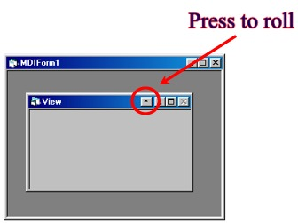



## xFormRoller ActiveX

### Description

Add this ActiveX to your form and a button will appear in the caption bar, 

You will be able to roll up and roll down your form. 

You can use it with your MDI forms or your child forms. 

No function to call, only place it on your Forms, and show must go on ... 

It is useful with toolbox by example, it allows to optimize the work area of your applications.  

Please vote for me ....  

Information and Download of the xFormRoller : http://vtech.ifrance.com/vtech/devzone/controls  

For update go to : http://vtech.ifrance.com/vtech/devzone
 
### More Info
 

             |
---                |---
**Submitted On**   |2000-09-05 15:31:34
**By**             |[N/A](https://github.com/Planet-Source-Code/PSCIndex/blob/master/ByAuthor/empty.md)
**Level**          |Advanced
**User Rating**    |4.8 (24 globes from 5 users)
**Compatibility**  |VB 6\.0
**Category**       |[OLE/ COM/ DCOM/ Active\-X](https://github.com/Planet-Source-Code/PSCIndex/blob/master/ByCategory/ole-com-dcom-active-x__1-29.md)
**World**          |[Visual Basic](https://github.com/Planet-Source-Code/PSCIndex/blob/master/ByWorld/visual-basic.md)
**Archive File**   |[CODE\_UPLOAD9641952000\.zip](https://github.com/Planet-Source-Code/xformroller-activex__1-11273/archive/master.zip)

